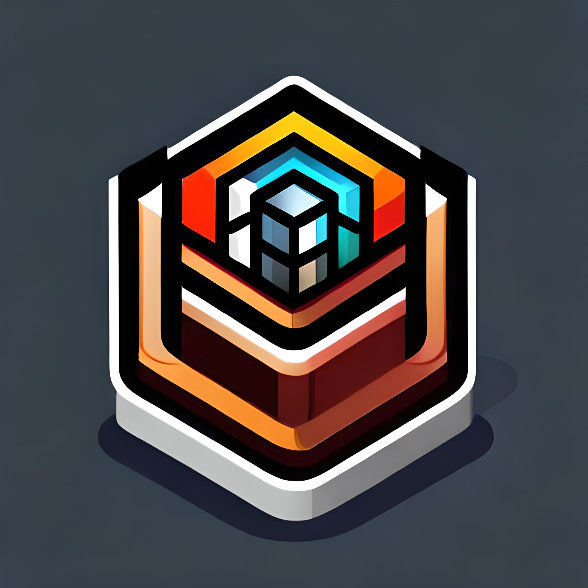

<!-- Improved compatibility of back to top link: See: https://github.com/coderloff/dunger/pull/73 -->
<a name="readme-top"></a>
<!--
*** Thanks for checking out the dunger. If you have a suggestion
*** that would make this better, please fork the repo and create a pull request
*** or simply open an issue with the tag "enhancement".
*** Don't forget to give the project a star!
*** Thanks again! Now go create something AMAZING! :D
-->


<!-- PROJECT SHIELDS -->
<!--
*** I'm using markdown "reference style" links for readability.
*** Reference links are enclosed in brackets [ ] instead of parentheses ( ).
*** See the bottom of this document for the declaration of the reference variables
*** for contributors-url, forks-url, etc. This is an optional, concise syntax you may use.
*** https://www.markdownguide.org/basic-syntax/#reference-style-links
-->
[![Contributors][contributors-shield]][contributors-url]
[![Forks][forks-shield]][forks-url]
[![Stargazers][stars-shield]][stars-url]
[![Issues][issues-shield]][issues-url]
[![MIT License][license-shield]][license-url]
[![LinkedIn][linkedin-shield]][linkedin-url]


<!-- PROJECT LOGO -->
<br />
<div align="center">
  <a href="https://github.com/coderloff/dunger">
    
  </a>

  <h3 align="center">Dunger</h3>

  <p align="center">
    A 3D Unity Package for Procedrual Dungeon Generation
    <br />
    <a href="https://github.com/coderloff/dunger"><strong>Explore the docs »</strong></a>
    <br />
    <br />
    <a href="https://github.com/coderloff/dunger">View Demo</a>
    ·
    <a href="https://github.com/coderloff/dunger/issues">Report Bug</a>
    ·
    <a href="https://github.com/coderloff/dunger/issues">Request Feature</a>
  </p>
</div>


<!-- TABLE OF CONTENTS -->
<details>
  <summary>Table of Contents</summary>
  <ol>
    <li>
      <a href="#about-the-project">About The Project</a>
      <ul>
        <li><a href="#built-with">Built With</a></li>
      </ul>
    </li>
    <li>
      <a href="#getting-started">Getting Started</a>
      <ul>
        <li><a href="#prerequisites">Prerequisites</a></li>
        <li><a href="#installation">Installation</a></li>
      </ul>
    </li>
    <li><a href="#usage">Usage</a></li>
    <li><a href="#roadmap">Roadmap</a></li>
    <li><a href="#contributing">Contributing</a></li>
    <li><a href="#license">License</a></li>
    <li><a href="#contact">Contact</a></li>
    <li><a href="#acknowledgments">Acknowledgments</a></li>
  </ol>
</details>


<!-- ABOUT THE PROJECT -->
## About The Project

[![Product Name Screen Shot][product-screenshot]](https://example.com)

Dunger is an open-source project developed in Unity that specializes in generating random dungeons for games and applications. It offers a straightforward and efficient way to create dynamic and ever-changing dungeon layouts for your Unity-based projects.

Key Features of Dunger:

* **Procedural Dungeon Generation:** Dunger streamlines the process of generating dungeons with just a few clicks. It uses procedural algorithms to create unique layouts, ensuring that players never experience the same dungeon twice.

* **Unity Integration:** Built exclusively for Unity, Dunger seamlessly integrates into your Unity projects. You can easily incorporate it into your game development workflow and start generating dungeons in no time.

* **Configurable Parameters:** Customize the dungeons to fit your specific needs. Adjust parameters like dungeon size, complexity, and room distribution to achieve the desired level of challenge and variety.

* **User-Friendly Interface:** Dunger provides an intuitive interface that makes it accessible to both seasoned developers and newcomers. You don't need to be a coding expert to create captivating dungeons.

* **Documentation and Support:** Dunger comes with comprehensive documentation and support resources to help you get started and troubleshoot any issues you might encounter.

### Why Choose Dunger:

Dunger simplifies the process of adding randomized dungeons to your Unity games or applications. Whether you're developing a roguelike adventure, a dungeon crawler, or any game that benefits from procedural level design, Dunger can save you time and effort while enhancing the player experience.

With Dunger, you can harness the power of procedural generation in Unity to keep your players engaged with fresh and unpredictable dungeons, making your project stand out in the world of game development.

Get started with Dunger in Unity today and bring dynamic dungeon exploration to your game world!

<p align="right">(<a href="#readme-top">back to top</a>)</p>


### Built With

Dunger is powered by the Unity game engine, harnessing its versatile capabilities for seamless integration and exceptional performance. The project leverages Unity's robust tools and resources to provide a user-friendly environment for generating random dungeons. With Dunger, you can take advantage of Unity's powerful features to create dynamic and engaging game worlds filled with procedurally generated dungeons.

<div align="center">
  
  
</div>

<p align="right">(<a href="#readme-top">back to top</a>)</p>


<!-- GETTING STARTED -->
## Getting Started

This is an example of how you may give instructions on setting up your project locally.
To get a local copy up and running follow these simple example steps.

### Prerequisites

This is an example of how to list things you need to use the software and how to install them.
* npm
  ```sh
  npm install npm@latest -g
  ```

### Installation

_Below is an example of how you can instruct your audience on installing and setting up your app. This template doesn't rely on any external dependencies or services._

1. Get a free API Key at [https://example.com](https://example.com)
2. Clone the repo
   ```sh
   git clone https://github.com/your_username_/Project-Name.git
   ```
3. Install NPM packages
   ```sh
   npm install
   ```
4. Enter your API in `config.js`
   ```js
   const API_KEY = 'ENTER YOUR API';
   ```

<p align="right">(<a href="#readme-top">back to top</a>)</p>


<!-- USAGE EXAMPLES -->
## Usage

Use this space to show useful examples of how a project can be used. Additional screenshots, code examples and demos work well in this space. You may also link to more resources.

_For more examples, please refer to the [Documentation](https://example.com)_

<p align="right">(<a href="#readme-top">back to top</a>)</p>


<!-- ROADMAP -->
## Roadmap

- [x] Add Changelog
- [x] Add back to top links
- [ ] Add Additional Templates w/ Examples
- [ ] Add "components" document to easily copy & paste sections of the readme
- [ ] Multi-language Support
    - [ ] Chinese
    - [ ] Spanish

See the [open issues](https://github.com/coderloff/dunger/issues) for a full list of proposed features (and known issues).

<p align="right">(<a href="#readme-top">back to top</a>)</p>


<!-- CONTRIBUTING -->
## Contributing

Contributions are what make the open source community such an amazing place to learn, inspire, and create. Any contributions you make are **greatly appreciated**.

If you have a suggestion that would make this better, please fork the repo and create a pull request. You can also simply open an issue with the tag "enhancement".
Don't forget to give the project a star! Thanks again!

1. Fork the Project
2. Create your Feature Branch (`git checkout -b feature/AmazingFeature`)
3. Commit your Changes (`git commit -m 'Add some AmazingFeature'`)
4. Push to the Branch (`git push origin feature/AmazingFeature`)
5. Open a Pull Request

<p align="right">(<a href="#readme-top">back to top</a>)</p>


<!-- LICENSE -->
## License

Distributed under the MIT License. See `LICENSE.txt` for more information.

<p align="right">(<a href="#readme-top">back to top</a>)</p>


<!-- CONTACT -->
## Contact

Huseyn - [@coderloff](https://twitter.com/coderloff) - contact@coderloff.com

Project Link: [https://github.com/coderloff/dunger](https://github.com/coderloff/dunger)

<p align="right">(<a href="#readme-top">back to top</a>)</p>


<!-- ACKNOWLEDGMENTS -->
## Acknowledgments

Use this space to list resources you find helpful and would like to give credit to. I've included a few of my favorites to kick things off!

* [Choose an Open Source License](https://choosealicense.com)
* [GitHub Emoji Cheat Sheet](https://www.webpagefx.com/tools/emoji-cheat-sheet)
* [Malven's Flexbox Cheatsheet](https://flexbox.malven.co/)
* [Malven's Grid Cheatsheet](https://grid.malven.co/)
* [Img Shields](https://shields.io)
* [GitHub Pages](https://pages.github.com)
* [Font Awesome](https://fontawesome.com)
* [React Icons](https://react-icons.github.io/react-icons/search)

<p align="right">(<a href="#readme-top">back to top</a>)</p>


<!-- MARKDOWN LINKS & IMAGES -->
<!-- https://www.markdownguide.org/basic-syntax/#reference-style-links -->
[contributors-shield]: https://img.shields.io/github/contributors/coderloff/dunger?style=for-the-badge&color=%2300ff00
[contributors-url]: https://github.com/coderloff/dunger/graphs/contributors
[forks-shield]: https://img.shields.io/github/forks/coderloff/dunger?style=for-the-badge
[forks-url]: https://github.com/coderloff/dunger/network/members
[stars-shield]: https://img.shields.io/github/stars/coderloff/dunger?style=for-the-badge&color=%23dfb317
[stars-url]: https://github.com/coderloff/dunger/stargazers
[issues-shield]: https://img.shields.io/github/issues/coderloff/dunger?style=for-the-badge&color=%23d0312d
[issues-url]: https://github.com/coderloff/dunger/issues
[license-shield]: https://img.shields.io/badge/License-MIT-green?style=for-the-badge
[license-url]: https://github.com/coderloff/dunger/blob/master/LICENSE.txt
[linkedin-shield]: https://img.shields.io/badge/-LinkedIn-black.svg?style=for-the-badge&logo=linkedin&colorB=555
[linkedin-url]: https://linkedin.com/in/coderloff
[product-screenshot]: images/screenshot.png
[Unity]: https://img.shields.io/badge/Made%20with-Unity-57b9d3.svg?style=for-the-badge&logo=unity
[Unity-url]: https://unity3d.com
[CSharp]: https://img.shields.io/badge/c%23-%23239120.svg?style=for-the-badge&logo=c-sharp&logoColor=white
[CSharp-url]: https://learn.microsoft.com/en-us/dotnet/csharp/
[Next.js]: https://img.shields.io/badge/next.js-000000?style=for-the-badge&logo=nextdotjs&logoColor=white
[Next-url]: https://nextjs.org/
[React.js]: https://img.shields.io/badge/React-20232A?style=for-the-badge&logo=react&logoColor=61DAFB
[React-url]: https://reactjs.org/
[Vue.js]: https://img.shields.io/badge/Vue.js-35495E?style=for-the-badge&logo=vuedotjs&logoColor=4FC08D
[Vue-url]: https://vuejs.org/
[Angular.io]: https://img.shields.io/badge/Angular-DD0031?style=for-the-badge&logo=angular&logoColor=white
[Angular-url]: https://angular.io/
[Svelte.dev]: https://img.shields.io/badge/Svelte-4A4A55?style=for-the-badge&logo=svelte&logoColor=FF3E00
[Svelte-url]: https://svelte.dev/
[Laravel.com]: https://img.shields.io/badge/Laravel-FF2D20?style=for-the-badge&logo=laravel&logoColor=white
[Laravel-url]: https://laravel.com
[Bootstrap.com]: https://img.shields.io/badge/Bootstrap-563D7C?style=for-the-badge&logo=bootstrap&logoColor=white
[Bootstrap-url]: https://getbootstrap.com
[JQuery.com]: https://img.shields.io/badge/jQuery-0769AD?style=for-the-badge&logo=jquery&logoColor=white
[JQuery-url]: https://jquery.com 
