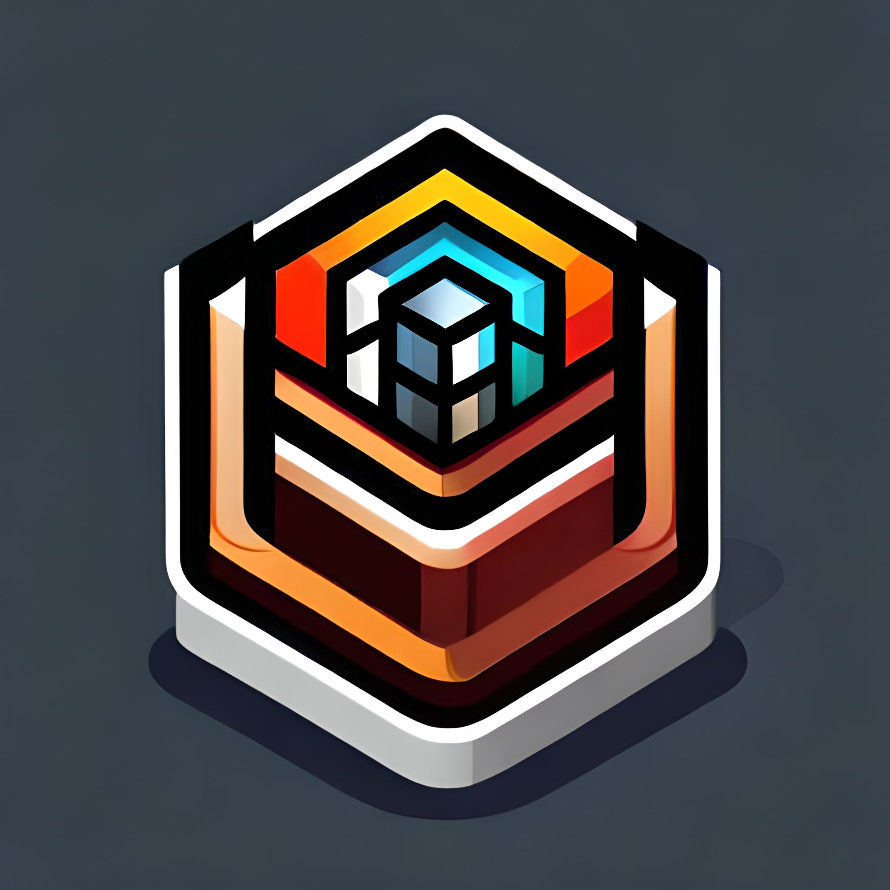

<a name="readme-top"></a>

<div align="center">
  
  
  
  
  
</div>


<!-- PROJECT LOGO -->
<br />
<div align="center">
  <a href="https://github.com/coderloff/dunger">
    
  </a>

  <h3 align="center">Dunger</h3>

  <p align="center">
    A 3D Unity Package for Procedrual Dungeon Generation
    <br />
    <a href="https://github.com/coderloff/dunger"><strong>Explore the docs »</strong></a>
    <br />
    <br />
    <a href="https://github.com/coderloff/dunger">View Demo</a>
    ·
    <a href="https://github.com/coderloff/dunger/issues">Report Bug</a>
    ·
    <a href="https://github.com/coderloff/dunger/issues">Request Feature</a>
  </p>
</div>


<!-- TABLE OF CONTENTS -->
<details>
  <summary>Table of Contents</summary>
  <ol>
    <li>
      <a href="#about-the-project">About The Project</a>
      <ul>
        <li><a href="#built-with">Built With</a></li>
      </ul>
    </li>
    <li>
      <a href="#getting-started">Getting Started</a>
      <ul>
        <li><a href="#prerequisites">Prerequisites</a></li>
        <li><a href="#installation">Installation</a></li>
      </ul>
    </li>
    <li><a href="#usage">Usage</a></li>
    <li><a href="#roadmap">Roadmap</a></li>
    <li><a href="#contributing">Contributing</a></li>
    <li><a href="#license">License</a></li>
    <li><a href="#contact">Contact</a></li>
    <li><a href="#acknowledgments">Acknowledgments</a></li>
  </ol>
</details>


<!-- ABOUT THE PROJECT -->
## About The Project

Dunger is an open-source project developed in Unity that specializes in generating random dungeons for games and applications. It offers a straightforward and efficient way to create dynamic and ever-changing dungeon layouts for your Unity-based projects.

Key Features of Dunger:

* **Procedural Dungeon Generation:** Dunger streamlines the process of generating dungeons with just a few clicks. It uses procedural algorithms to create unique layouts, ensuring that players never experience the same dungeon twice.

* **Unity Integration:** Built exclusively for Unity, Dunger seamlessly integrates into your Unity projects. You can easily incorporate it into your game development workflow and start generating dungeons in no time.

* **Configurable Parameters:** Customize the dungeons to fit your specific needs. Adjust parameters like dungeon size, complexity, and room distribution to achieve the desired level of challenge and variety.

* **User-Friendly Interface:** Dunger provides an intuitive interface that makes it accessible to both seasoned developers and newcomers. You don't need to be a coding expert to create captivating dungeons.

* **Documentation and Support:** Dunger comes with comprehensive documentation and support resources to help you get started and troubleshoot any issues you might encounter.

### Why Choose Dunger:

Dunger simplifies the process of adding randomized dungeons to your Unity games or applications. Whether you're developing a roguelike adventure, a dungeon crawler, or any game that benefits from procedural level design, Dunger can save you time and effort while enhancing the player experience.

With Dunger, you can harness the power of procedural generation in Unity to keep your players engaged with fresh and unpredictable dungeons, making your project stand out in the world of game development.

Get started with Dunger in Unity today and bring dynamic dungeon exploration to your game world!

<p align="right"><a href="#readme-top">↑ Back to top</a></p>


### Built With

Dunger is powered by the Unity game engine, harnessing its versatile capabilities for seamless integration and exceptional performance. The project leverages Unity's robust tools and resources to provide a user-friendly environment for generating random dungeons. With Dunger, you can take advantage of Unity's powerful features to create dynamic and engaging game worlds filled with procedurally generated dungeons.

<div align="center">
  
  
</div>

<p align="right"><a href="#readme-top">↑ Back to top</a></p>


<!-- GETTING STARTED -->
## Getting Started

This is an example of how you may give instructions on setting up your project locally.
To get a local copy up and running follow these simple example steps.

### Prerequisites

Before installing Dunger, ensure that you have the following prerequisites in place:

* **Unity:** Dunger is specifically designed for the Unity game engine. Make sure you have Unity installed on your development machine. You can download Unity from the official Unity website.

* **GitHub Access:** If you plan to clone Dunger from GitHub, you'll need a GitHub account and a Git client installed on your machine for version control.

* **Existing Unity Project:** If you're integrating Dunger into an existing Unity project, ensure that your project is set up and compatible with the Unity version specified in Dunger's documentation.

Having these prerequisites in order will help you smoothly install and work with Dunger in your Unity environment.

### Installation

Dunger offers a hassle-free installation process, providing two convenient options:

#### Cloning from GitHub:

To start a new project with Dunger, simply clone the Dunger repository from GitHub to your local machine. You can then open the project directly in Unity, making it easy to get started with dungeon generation right away.

1. Clone the repo
   ```sh
   git clone https://github.com/coderloff/dunger
   ```
2. Open clonned project using `Unity Hub`

#### Importing as a Unity Package:

If you already have an existing Unity project and want to integrate Dunger, you can import it as a Unity package. This allows you to seamlessly add Dunger's dungeon generation capabilities to your ongoing project, enhancing its gameplay with dynamic dungeons.

1. Download `unitypackage` by clicking [here](https://github.com/coderloff/dunger/releases/download/v1.0.0/Dunger.unitypackage)

2. Open your Unity project

3. Double-click on the downloaded package

4. Click `install` in Unity

<p align="right"><a href="#readme-top">↑ Back to top</a></p>


<!-- USAGE EXAMPLES -->
## Usage

Using Dunger to generate random dungeons in your Unity project is a straightforward process. Here's a quick guide:

1. **New Project Setup:**
If you're starting a new project, clone Dunger from GitHub and open it in Unity. Dunger will be ready to use, and you can begin customizing and generating dungeons right away.

2. **Existing Project Integration:**
If you have an existing Unity project, import Dunger as a Unity package. Once integrated, you can access Dunger's functionality through Unity's user-friendly interface.

3. **Customization:**
Customize your dungeons by adjusting parameters such as size, complexity, and room distribution to achieve the desired level of challenge and variety.

4. **Script Integration:**
For advanced users, Dunger offers script-based integration, allowing you to control dungeon generation programmatically. Use this option to create unique and dynamic gameplay experiences.

<p align="right"><a href="#readme-top">↑ Back to top</a></p>


<!-- ROADMAP -->
## Roadmap

- [x] Add Changelog
- [x] Add back to top links
- [ ] Add Additional Templates w/ Examples
- [ ] Add "components" document to easily copy & paste sections of the readme
- [ ] Multi-language Support
    - [ ] Chinese
    - [ ] Spanish

See the [open issues](https://github.com/coderloff/dunger/issues) for a full list of proposed features (and known issues).

<p align="right"><a href="#readme-top">↑ Back to top</a></p>


<!-- CONTRIBUTING -->
## Contributing

We welcome contributions from the community to help Dunger thrive. Here's how you can get involved:

1. **Filing Issues:** If you encounter bugs or have suggestions for improvements, please open an issue on our GitHub repository. Be sure to provide details and context to help us understand the issue.

2. **Pull Requests:** We appreciate pull requests for bug fixes, feature enhancements, or new additions. Make sure your contributions align with our project's goals and coding standards.

3. **Documentation:** Improving our documentation is a valuable way to contribute. If you find areas that need clarification or want to add examples, your help is greatly appreciated.

4. **Community Support:** Join discussions, answer questions, and share your knowledge on our community forums. Your expertise can be a valuable resource for fellow Dunger users.

5. **Spread the Word:** Help us grow the Dunger community by sharing your experiences with others. Tweet about your projects, write blog posts, or create tutorials featuring Dunger.


<p align="right"><a href="#readme-top">↑ Back to top</a></p>


<!-- LICENSE -->
## License

Distributed under the MIT License. See `LICENSE.txt` for more information.

<p align="right"><a href="#readme-top">↑ Back to top</a></p>


<!-- CONTACT -->
## Contact

Huseyn Ismayilov - [@coderloff](https://twitter.com/coderloff) - contact@coderloff.com

Project Link: [https://github.com/coderloff/dunger](https://github.com/coderloff/dunger)

<div align="center">
  <a href="https://www.linkedin.com/in/coderloff/" target="_blank">
    
  </a>
  <a href="https://www.youtube.com/channel/UC-z0HI2-UU-ThjUDz2Bsevg" target="_blank">
    
  </a>
  <a href="mailto:contact@coderloff.com" target="_blank">
    
  </a>
  <a href="https://discord.gg/UmyXBBTFkE" target="_blank">
    
  </a>
  <a href="https://twitter.com/coderloff" target="_blank">
    
  </a>
  <a href="instagram.com/coderloff/" target="_blank">
    
  </a>
  <a href="https://www.twitch.tv/coderloff" target="_blank">
    
  </a>
</div>

<p align="right"><a href="#readme-top">↑ Back to top</a></p>


<!-- ACKNOWLEDGMENTS -->
## Acknowledgments

Dunger wouldn't be possible without the support, contributions, and inspiration from the following individuals and projects:

* **Sunny Valley Studio:** Thanks a lot to [Peter](https://github.com/sunnyValleyStudio) for his great support for the project.

* **Our Community:** We extend our gratitude to the Dunger community for their feedback, enthusiasm, and collaboration in shaping the project.

* **Open Source Contributors:** Many individuals have dedicated their time and expertise to improve Dunger. Your contributions are invaluable.

* **Unity:** We thank the Unity team for providing the platform that makes Dunger possible and for supporting the developer community.

* **Our Users:** Last but not least, a big thank you to all Dunger users. Your creativity and innovation using our tool drive us to keep improving.

<p align="right"><a href="#readme-top">↑ Back to top</a></p>